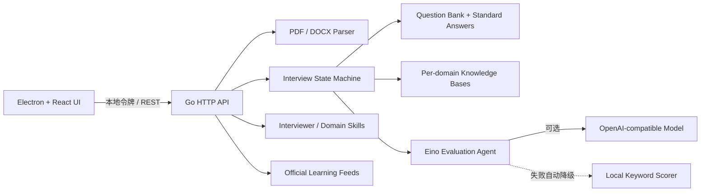

# Interview Copilot

Interview Copilot 是一个使用 Go + Eino + Electron 构建的桌面面试对话助手。它可以在本机读取 PDF / DOCX 简历，提取技术关键词，围绕 Golang、Java、Python、C++ 发起结构化面试，并在结束后用标准答案逐题复盘。

当前版本：`v0.2.0`

## 已实现能力

- PDF、DOCX 简历上传、文本提取与技术关键词识别；文件上限 10 MB。
- Golang、Java、Python、C++ 四套内置题库，共 24 道题。
- 4 个独立面试官风格 Skill：温和教练、架构面试官、压力挑战官、启发导师；每个 Skill 拥有独立提示词、评价重点和反馈语气。
- 领域能力以 Manifest Skill 组织：当前包含计算机基础公共 Skill 与 Go、Java、Python、C++ 语言 Skill；新增行业只需增加 Manifest 和对应知识库。
- 每道题都包含难度、标签、关键点和人工编写的标准答案。
- 按简历关键词优先选择相关题目，支持基础、进阶、挑战和智能混合模式。
- OpenAI-compatible 模型配置：`API Key`、`Base URL`、`Model`、`Speech Model`。
- 使用 Eino ChatModel 进行题目生成、意图识别和答案评价；模型未配置或调用失败时自动降级为内置题库与本地关键点评分。
- 面试计时、进度、连续对话、模型意图理解式追问/提示/偏题拉回/跳过、逐题即时反馈，以及最终综合分数和标准答案复盘。
- 可选视频面试模式，支持摄像头预览和中文/英文语音输入；语音优先使用浏览器识别，不可用时回退到后端音频转写；服务端预留 ModelScope CAM++ 声纹模型适配边界。
- 分语言持久化知识库与计算机基础公共库；面试实际出题会自动累计并沉淀为可检索 QA，也支持手动新增 QA。
- 学习中心聚合 Go、Java、Spring、Python、C++ 官方/权威 Feed，并提供官方文档、课程、视频和本地学习清单。
- Electron 上下文隔离、本地随机访问令牌、仅监听 `127.0.0.1`；简历原文件解析完成后立即删除。

## 快速开始

环境要求：

- Go `1.24.1+`
- Node.js `22+`
- npm `10+`

安装依赖并启动桌面开发模式：

```bash
npm install
npm run dev
```

开发模式会同时启动 Vite、Electron 和本地 Go 服务。桌面端优先使用 `127.0.0.1:46831`，若端口已被占用会自动选择可用端口；Electron 会为本次进程生成随机访问令牌，并把实际 API 地址同步注入前端。

只启动后端：

```bash
go run ./cmd/server -port 46831
```

只验证前端：

```bash
npm run build:renderer
```

运行完整检查：

```bash
npm test
```

## 配置大模型

在桌面端左下角打开“模型设置”，填写：

- `API Key`：模型服务的凭据；
- `Base URL`：OpenAI-compatible API 地址，可留空使用 SDK 默认地址；
- `Model`：用于出题、意图识别和点评的对话模型 ID；
- `Speech Model`：用于录音兜底转写的音频模型 ID，例如 `whisper-1` 或服务商提供的转写模型。

点击“测试连接”成功后，创建面试会优先通过模型生成本场题目，逐题交互会通过模型理解意图并评价答案。模型不可用不会中断面试，而是自动使用内置题库和本地规则评分。单次回答链路控制在 20 秒内，前端会显示“理解意图、生成反馈、更新进度”的处理流程。

语音输入不会自动提交答案。浏览器识别路径会实时把临时识别结果写入回答框，用户可以修改后再发送；如果 Electron 环境不支持 Web Speech API，语音按钮会自动改用录音转写。录音转写会调用当前 `Base URL` 下的 OpenAI-compatible `/audio/transcriptions`，并优先通过 `/speech/transcriptions/stream` 将转写增量流式写入回答框；如果服务商不支持流式转写，则退化为一次性写入最终文本。流式解析兼容常见 SSE 增量格式与 LF / CRLF 分隔。转写使用 `Speech Model` 字段；如果该字段为空或模型不支持音频，界面会显示可读错误。

配置文件保存在 Electron `userData/data/model-config.json`，权限为 `0600`。它不会写入仓库或日志。生产环境若需要更高安全级别，建议将 API Key 迁移到系统 Keychain / Credential Manager。

## 项目结构

```text
cmd/server/                 Go HTTP 服务入口
internal/agent/             Eino 模型评价 Agent
internal/api/               本地 REST API 与安全中间件
internal/config/            模型配置持久化
internal/interview/         面试状态机、评分降级与报告
internal/skills/            面试官与行业/语言 Skill Manifest
internal/knowledge/         分库 QA 持久化、出题记录与检索
internal/learning/          权威 Feed 聚合和学习清单
internal/parser/            PDF / DOCX 解析和关键词提取
internal/questions/         四语言标准题库
electron/                   Electron 主进程和 preload
src/                        React 桌面 UI
docs/requirements.md        需求文档
docs/api.md                 接口文档
CHANGELOG.md                版本变更记录
```

## 架构



## 构建桌面安装包

```bash
npm run dist
```

`npm run build` 会先构建 React 页面，再把当前平台的 Go 服务编译到 `resources/bin/`；`electron-builder` 随后生成当前平台安装包。跨平台发布建议在 macOS、Windows、Linux 各自的 CI runner 上构建。

## 当前边界

- 扫描版 PDF 暂不带 OCR；上传后若无法提取文本，会提示先进行 OCR。
- 当前面试会话保存在内存，关闭应用后不会保留历史记录；模型配置会保留。
- 题库是代码内置数据，下一版本可迁移到可管理的数据源。
- 知识库当前使用本地 JSON 文档和关键词相关性检索；接口已隔离，后续可替换为 SQLite、全文检索或向量库。
- 学习中心只保存标题、链接和短摘要，不复制原站文章或视频；实际阅读在权威原站完成。
- 视频面试当前提供摄像头预览和浏览器语音输入；声纹确认、情绪识别和完整音视频分析需要后续接入独立推理服务。

## 扩展 Skill 与行业

面试官 Skill 位于 `internal/skills/manifests/interviewer/`，领域 Skill 位于 `internal/skills/manifests/domain/<industry>/`。每个领域 Skill 声明 `industry`、`language`、`knowledgeBaseId`、主题和出题提示词。增加金融、制造、医疗等行业时，可以新增行业目录与 Manifest，而不需要修改 UI 的领域选择逻辑。

当前知识库：

- `computer-foundation`：操作系统、网络、数据库、缓存和分布式系统公共题；
- `computer-golang`；
- `computer-java`；
- `computer-python`；
- `computer-cpp`。

## 权威学习来源

学习中心支持手动刷新以下 Feed，并内置官方文档/视频入口：

- The Go Blog；
- Inside Java 与 Spring Blog；
- Python Insider；
- Microsoft C++ Team Blog；
- Go Tour、dev.java、Python Tutorial、C++ Core Guidelines；
- MIT OpenCourseWare、Go / Java 官方视频、PyCon US 与 CppCon。

## 版本与提交约定

每次功能更新应同步修改：

1. `CHANGELOG.md`；
2. `README.md`；
3. `docs/requirements.md`；
4. `docs/api.md`（接口有变化时）；
5. 自动化测试。

提交前运行 `npm test`。GitHub 远端为 `git@github.com:concayim/interview-agent.git`，首次配置和推送示例：

```bash
git remote add origin git@github.com:concayim/interview-agent.git
git push -u origin <branch>
```

技术组件：[CloudWeGo Eino](https://github.com/cloudwego/eino)、[Electron](https://www.electronjs.org/)、[React](https://react.dev/)。
