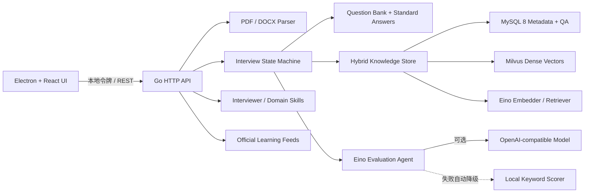

# Interview Copilot

Interview Copilot 是一个使用 Go + Eino + Electron 构建的桌面面试对话助手。它可以在本机读取 PDF / DOCX 简历，提取技术关键词，围绕 Golang、Java、Python、C++ 发起结构化面试，并在结束后用标准答案逐题复盘。

当前版本：`v0.2.0`

## 已实现能力

- PDF、DOCX 简历上传、文本提取与技术关键词识别；文件上限 10 MB。
- Golang、Java、Python、C++ 四套内置题库，共 24 道题。
- 4 个独立面试官风格 Skill：温和教练、架构面试官、压力挑战官、启发导师；每个 Skill 拥有独立提示词、评价重点和反馈语气。
- 领域能力以 Manifest Skill 组织：当前包含计算机基础公共 Skill 与 Go、Java、Python、C++ 语言 Skill；新增行业只需增加 Manifest 和对应知识库。
- 每道题都包含难度、标签、关键点和人工编写的标准答案。
- 按简历关键词优先选择相关题目，支持基础、进阶、挑战和智能混合模式。
- OpenAI-compatible 对话模型配置，以及独立的火山引擎实时语音识别配置。
- 面试优先从所选领域知识库的 QA 对出题；Eino ChatModel 负责意图识别、标准答案语义相似度评分和细化追问，模型或知识库不可用时自动降级。
- 面试计时、进度、连续对话、模型意图理解式提示/偏题拉回/跳过，以及低于 75 分时按面试官风格持续追问；达到 75 分后才进入下一题并在结束后按标准答案复盘。
- 可选视频面试模式，支持摄像头预览和中文/英文完整面试；英语模式会使用英文题目、英文追问与评价、`en-US` 实时识别和英文 TTS 朗读。
- 双向语音面试：候选人回答通过豆包 ASR 实时转文字，面试官开场、题目、追问和反馈可通过豆包 TTS 自动朗读，并支持静音和题目重播。
- 分语言持久化知识库与计算机基础公共库；面试实际出题会自动累计并沉淀为可检索 QA，也支持手动新增 QA。
- 学习中心聚合 Go、Java、Spring、Python、C++ 官方/权威 Feed，并提供官方文档、课程、视频和本地学习清单。
- Electron 上下文隔离、本地随机访问令牌、仅监听 `127.0.0.1`；简历原文件解析完成后立即删除。

## 快速开始

环境要求：

- Go `1.24.1+`
- Node.js `22+`
- npm `10+`
- MySQL `8.x`
- Milvus `2.4+`

知识库外部依赖均为可选配置。未配置 MySQL 时使用本地 JSON 知识库；配置 MySQL 后它成为权威存储；仅在同时配置 Milvus 地址时启用混合向量检索：

```bash
export INTERVIEW_AGENT_MYSQL_DSN='interview_agent:password@tcp(127.0.0.1:3307)/interview_agent?charset=utf8mb4&parseTime=true&loc=Local'
export INTERVIEW_AGENT_MILVUS_ADDR='127.0.0.1:19530'
export INTERVIEW_AGENT_MILVUS_COLLECTION='interview_agent_qa'
export INTERVIEW_AGENT_EMBEDDING_DIMENSION='384'
export INTERVIEW_AGENT_KNOWLEDGE_DEPENDENCY_TIMEOUT_SECONDS='8'
```

可选用阿里云百炼 OpenAI-compatible 向量模型替代本地 HashEmbedder。API Key 仅通过环境变量提供：

```bash
export INTERVIEW_AGENT_EMBEDDING_BASE_URL='https://dashscope.aliyuncs.com/compatible-mode/v1'
export INTERVIEW_AGENT_EMBEDDING_API_KEY='your-api-key'
export INTERVIEW_AGENT_EMBEDDING_MODEL='text-embedding-v4'
export INTERVIEW_AGENT_EMBEDDING_DIMENSION='512'
export INTERVIEW_AGENT_EMBEDDING_BATCH_SIZE='10'
export INTERVIEW_AGENT_MILVUS_COLLECTION='interview_agent_qa_v4_512'
```

启用远程向量模型后，已有 Milvus collection 的向量维度必须与 `INTERVIEW_AGENT_EMBEDDING_DIMENSION` 一致；服务启动会按批次重新生成全部 QA 向量。

MySQL 账号应只授予 `interview_agent` 数据库权限，不要把生产密码写入仓库。后端会自动创建 `knowledge_base`、`knowledge_qa` 表和 Milvus collection。MySQL 不可连接时会回退本地 JSON；Milvus 未配置、不可连接或投影失败时会保留 MySQL 读写并降级为关键词检索，不影响桌面应用启动。

安装依赖并启动桌面开发模式：

```bash
npm install
npm run dev
```

开发模式会同时启动 Vite、Electron 和本地 Go 服务。桌面端优先使用 `127.0.0.1:46831`，若端口已被占用会自动选择可用端口；Electron 会为本次进程生成随机访问令牌，并把实际 API 地址同步注入前端。

只启动后端：

```bash
go run ./cmd/server -port 46831
```

只验证前端：

```bash
npm run build:renderer
```

运行完整检查：

```bash
npm test
```

## 配置大模型

在桌面端左下角打开“模型设置”，填写：

- `API Key`：模型服务的凭据；
- `Base URL`：OpenAI-compatible API 地址，可留空使用 SDK 默认地址；
- `Model`：用于出题、意图识别和点评的对话模型 ID；
- `Access Token / API Key`：旧版控制台填写 Access Token，新版控制台填写 API Key；
- `App ID`：旧版控制台必填，新版控制台留空；
- `Resource ID`：默认 `volc.bigasr.sauc.duration`（流式语音识别 1.0 按时长计费），请按控制台开通的资源修改。
- `TTS Access Token / API Key`、`TTS App ID`：豆包 TTS 独立凭据；
- `TTS Resource ID`：`seed-tts-1.0` 或 `seed-tts-2.0`，必须与已开通的产品和音色版本匹配；
- `音色 ID`：从豆包语音控制台的音色列表复制。

点击“测试连接”成功后，创建面试会优先从领域 Skill 绑定的知识库选择 QA，并优先使用出题次数较少、与简历关键词和领域主题相关的记录。逐题交互会通过模型理解意图，并按知识库标准答案对累计回答进行 0–100 的语义相似度评分；低于 75 分时当前面试官会针对缺失点继续追问，达到 75 分后进入下一题。模型不可用不会中断面试，会自动使用本地关键点评分和风格化追问；知识库没有可用 QA 时才回退模型生成题或内置题。单次回答链路控制在 20 秒内，前端会显示“理解意图、生成反馈、组织细化追问/更新进度”的处理流程。

语音输入不会自动提交答案。点击语音按钮后，前端把麦克风音频降采样为 16 kHz、16-bit、单声道 PCM，通过本地 WebSocket 服务实时转发到火山 `bigmodel_async` 接口，临时识别结果会持续更新回答框；再次点击会结束音频并等待最终文本。API Key 只保存在 Go 服务端，不会发送给页面或写入日志。

准备页的“面试语言”同时控制题目、面试官回复、评价、ASR 与 TTS。选择 `English` 后，模型出题会被要求只返回英语；模型未配置或暂不可用时，应用也会按领域 Skill 生成英语题目和英语本地反馈，不会退回中文题库。当前豆包 TTS 音色需要支持英语或多语种，已配置的 Vivi 2.0 可直接朗读英文文本。

启用 TTS 后，面试页会自动朗读开场、当前题目、追问以及评价摘要和下一题。开始录音会立即停止朗读，避免扬声器声音被 ASR 回录；顶部扬声器按钮可静音，题目旁按钮可重播。当前账号必须另外开通豆包 TTS 资源，ASR 的 Resource ID 不能用于 TTS。

配置文件保存在 Electron `userData/data/model-config.json`，权限为 `0600`。它不会写入仓库或日志。生产环境若需要更高安全级别，建议将 API Key 迁移到系统 Keychain / Credential Manager。

## 项目结构

```text
cmd/server/                 Go HTTP 服务入口
internal/agent/             Eino 模型评价 Agent
internal/api/               本地 REST API 与安全中间件
internal/config/            模型配置持久化
internal/interview/         面试状态机、评分降级与报告
internal/skills/            面试官与行业/语言 Skill Manifest
internal/knowledge/         分库 QA 持久化、出题记录与检索
internal/learning/          权威 Feed 聚合和学习清单
internal/parser/            PDF / DOCX 解析和关键词提取
internal/questions/         四语言标准题库
electron/                   Electron 主进程和 preload
src/                        React 桌面 UI
docs/requirements.md        需求文档
docs/api.md                 接口文档
CHANGELOG.md                版本变更记录
```

## 架构



## 构建桌面安装包

```bash
npm run dist
```

`npm run build` 会先构建 React 页面，再把当前平台的 Go 服务编译到 `resources/bin/`；`electron-builder` 随后生成当前平台安装包。跨平台发布建议在 macOS、Windows、Linux 各自的 CI runner 上构建。

## 当前边界

- 面试页已接入 AIRI 同类架构的本地 VRM 形象舞台：形象会随实时听写、模型思考和豆包 TTS 播放切换聆听、思考、说话状态。对话仍由现有 Go 服务统一管理，不嵌入第二套聊天运行时。
- 默认形象为 VRM 官方规范仓库的 Seed-san 示例模型（VirtualCast, Inc.），按 VRM Public License 1.0 本地打包并在界面署名；授权详情见 `public/models/LICENSE.txt`。

- 扫描版 PDF 暂不带 OCR；上传后若无法提取文本，会提示先进行 OCR。
- 当前面试会话保存在内存，关闭应用后不会保留历史记录；模型配置会保留。
- 内置题库作为知识库种子和异常降级来源；实际面试优先读取可管理的知识库 QA。
- 知识库使用 MySQL 保存 QA、标签、来源、时间和出题统计，使用 Milvus 保存向量；查询采用关键词召回与向量召回的 RRF 融合。旧版本地 JSON 会在启动时幂等导入 MySQL。
- 学习中心只保存标题、链接和短摘要，不复制原站文章或视频；实际阅读在权威原站完成。
- 视频面试当前提供摄像头预览和火山实时语音输入；声纹确认、情绪识别和完整音视频分析需要后续接入独立推理服务。

## 扩展 Skill 与行业

面试官 Skill 位于 `internal/skills/manifests/interviewer/`，领域 Skill 位于 `internal/skills/manifests/domain/<industry>/`。每个领域 Skill 声明 `industry`、`language`、`knowledgeBaseId`、主题和出题提示词。增加金融、制造、医疗等行业时，可以新增行业目录与 Manifest，而不需要修改 UI 的领域选择逻辑。

当前知识库：

- `computer-foundation`：操作系统、网络、数据库、缓存和分布式系统公共题；
- `computer-golang`；
- `computer-java`；
- `computer-python`；
- `computer-cpp`。

## 权威学习来源

学习中心支持手动刷新以下 Feed，并内置官方文档/视频入口：

- The Go Blog；
- Inside Java 与 Spring Blog；
- Python Insider；
- Microsoft C++ Team Blog；
- Go Tour、dev.java、Python Tutorial、C++ Core Guidelines；
- MIT OpenCourseWare、Go / Java 官方视频、PyCon US 与 CppCon。

## 版本与提交约定

每次功能更新应同步修改：

1. `CHANGELOG.md`；
2. `README.md`；
3. `docs/requirements.md`；
4. `docs/api.md`（接口有变化时）；
5. 自动化测试。

提交前运行 `npm test`。GitHub 远端为 `git@github.com:concayim/interview-agent.git`，首次配置和推送示例：

```bash
git remote add origin git@github.com:concayim/interview-agent.git
git push -u origin <branch>
```

技术组件：[CloudWeGo Eino](https://github.com/cloudwego/eino)、[Electron](https://www.electronjs.org/)、[React](https://react.dev/)。
