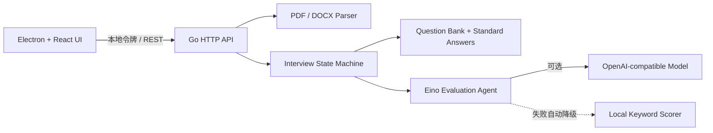

# Interview Copilot

Interview Copilot 是一个使用 Go + Eino + Electron 构建的桌面面试对话助手。它可以在本机读取 PDF / DOCX 简历，提取技术关键词，围绕 Golang、Java、Python、C++ 发起结构化面试，并在结束后用标准答案逐题复盘。

当前版本：`v0.1.0`（可运行 MVP）

## 已实现能力

- PDF、DOCX 简历上传、文本提取与技术关键词识别；文件上限 10 MB。
- Golang、Java、Python、C++ 四套内置题库，共 24 道题。
- 每道题都包含难度、标签、关键点和人工编写的标准答案。
- 按简历关键词优先选择相关题目，支持基础、进阶、挑战和智能混合模式。
- OpenAI-compatible 模型配置：`API Key`、`Base URL`、`Model`。
- 使用 Eino ChatModel 进行答案评价；模型未配置或调用失败时自动降级为本地关键点评分。
- 面试计时、进度、连续对话、逐题即时反馈，以及最终综合分数和标准答案复盘。
- Electron 上下文隔离、本地随机访问令牌、仅监听 `127.0.0.1`；简历原文件解析完成后立即删除。

## 快速开始

环境要求：

- Go `1.24.1+`
- Node.js `22+`
- npm `10+`

安装依赖并启动桌面开发模式：

```bash
npm install
npm run dev
```

开发模式会同时启动 Vite、Electron 和本地 Go 服务。桌面端默认使用 `127.0.0.1:46831`，Electron 会为本次进程生成随机访问令牌。

只启动后端：

```bash
go run ./cmd/server -port 46831
```

只验证前端：

```bash
npm run build:renderer
```

运行完整检查：

```bash
npm test
```

## 配置大模型

在桌面端左下角打开“模型设置”，填写：

- `API Key`：模型服务的凭据；
- `Base URL`：OpenAI-compatible API 地址，可留空使用 SDK 默认地址；
- `Model`：模型 ID。

点击“测试连接”成功后，逐题评价会通过 Eino 调用大模型。模型不可用不会中断面试，而是自动使用本地规则评分。

配置文件保存在 Electron `userData/data/model-config.json`，权限为 `0600`。它不会写入仓库或日志。生产环境若需要更高安全级别，建议将 API Key 迁移到系统 Keychain / Credential Manager。

## 项目结构

```text
cmd/server/                 Go HTTP 服务入口
internal/agent/             Eino 模型评价 Agent
internal/api/               本地 REST API 与安全中间件
internal/config/            模型配置持久化
internal/interview/         面试状态机、评分降级与报告
internal/parser/            PDF / DOCX 解析和关键词提取
internal/questions/         四语言标准题库
electron/                   Electron 主进程和 preload
src/                        React 桌面 UI
docs/requirements.md        需求文档
docs/api.md                 接口文档
CHANGELOG.md                版本变更记录
```

## 架构



## 构建桌面安装包

```bash
npm run dist
```

`npm run build` 会先构建 React 页面，再把当前平台的 Go 服务编译到 `resources/bin/`；`electron-builder` 随后生成当前平台安装包。跨平台发布建议在 macOS、Windows、Linux 各自的 CI runner 上构建。

## 当前边界

- 扫描版 PDF 暂不带 OCR；上传后若无法提取文本，会提示先进行 OCR。
- 当前面试会话保存在内存，关闭应用后不会保留历史记录；模型配置会保留。
- 题库是代码内置数据，下一版本可迁移到可管理的数据源。
- 暂未实现语音输入、语音面试和摄像头分析。

## 版本与提交约定

每次功能更新应同步修改：

1. `CHANGELOG.md`；
2. `README.md`；
3. `docs/requirements.md`；
4. `docs/api.md`（接口有变化时）；
5. 自动化测试。

提交前运行 `npm test`。GitHub 远端地址提供后，可添加远端并推送：

```bash
git remote add origin <github-url>
git push -u origin main
```

技术组件：[CloudWeGo Eino](https://github.com/cloudwego/eino)、[Electron](https://www.electronjs.org/)、[React](https://react.dev/)。
